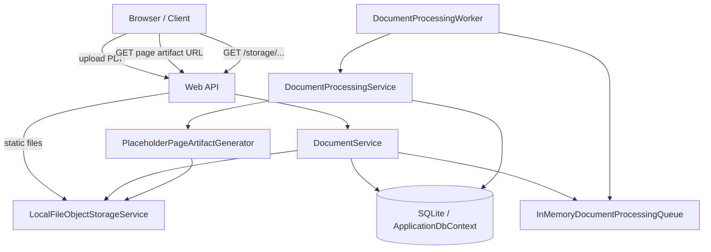
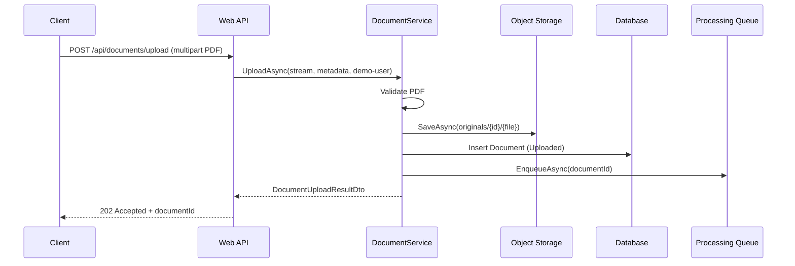
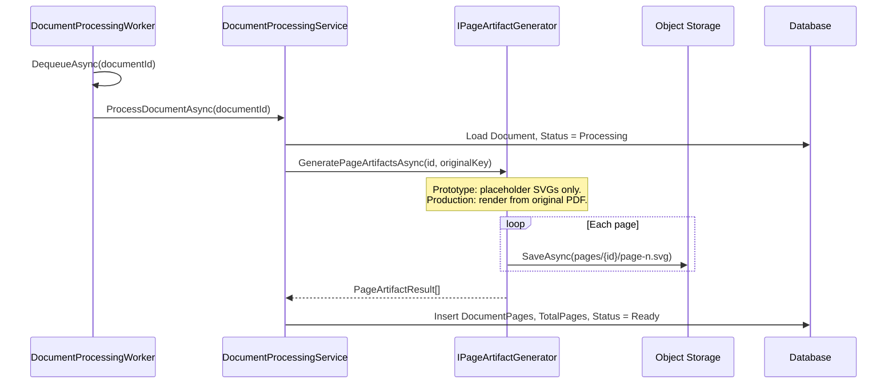
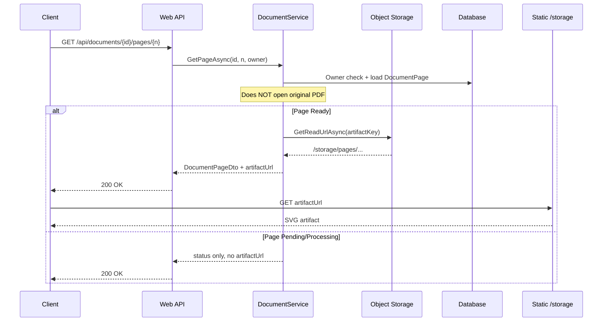
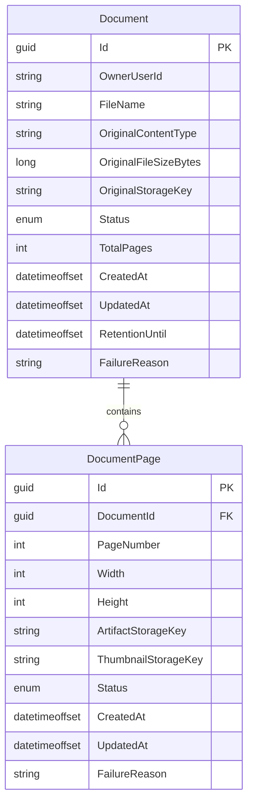

# Large Document Processing — Architecture

Architecture for the **Large Document Processing** technical exercise (construction-plan PDF upload, async page artifact generation, fast page retrieval). Primary API: `/api/documents`.

**Prototype honesty:** `PlaceholderPageArtifactGenerator` writes three SVG files per document and does not render the uploaded PDF. Production implements `IPageArtifactGenerator` with PDFium, MuPDF, Ghostscript, or a cloud rendering service.

**Architecture decision:** [ADR 0001: Use Page-Level Artifacts for Browser Rendering](adr/0001-use-page-level-artifacts.md) — why reads never parse the full PDF and how this meets the sub-2-second page SLA.

## 1. High-level architecture

The system separates **write** (upload + async processing) from **read** (page artifacts only). Clean Architecture layers:

| Layer | Responsibility |
|-------|----------------|
| **Domain** | `Document`, `DocumentPage`, status enums |
| **Application** | `IDocumentService`, contracts for storage, queue, processing, artifact generation |
| **Infrastructure** | SQLite EF Core, local file storage, in-memory queue, background worker, placeholder generator |
| **Web** | Minimal APIs, static serving of `/storage` |

## Prototype vs Production Components

**Not implemented locally:** Redis, RabbitMQ, S3, CDN, or real PDF rendering. The prototype uses concrete Infrastructure classes; production replaces them via interfaces.

| Concern | Prototype | Production |
|--------|-----------|------------|
| Queue | In-memory `Channel<Guid>` | RabbitMQ / SQS / Azure Service Bus |
| Storage | Local disk `./storage` | S3 / Azure Blob |
| Page delivery | `/storage` static files | CDN + signed URLs |
| Cache | None | Redis for metadata / signed URL cache |
| Renderer | Placeholder SVG | PDFium / MuPDF / Ghostscript / cloud renderer |
| Database | SQLite / EF Core local | PostgreSQL / SQL Server |
| Worker scaling | Single `BackgroundService` | Horizontally scaled worker pool |
| Upload path | Multipart upload through Web API | Presigned multipart upload directly to object storage |
| Retention | `RetentionUntil` field | Object lifecycle policy + legal hold |
| Resilience | Basic `Failed` status | Retry, DLQ, visibility timeout, idempotent reprocessing |
| Security | `demo-user` | Real authentication, authorization, signed URLs, antivirus scanning |

**Extension points:** `IObjectStorageService` (`LocalFileObjectStorageService` today), `IDocumentProcessingQueue` (`InMemoryDocumentProcessingQueue` today), `IPageArtifactGenerator` (`PlaceholderPageArtifactGenerator` today).

## 2. Component diagram

## 3. Upload sequence

## 4. Processing sequence

## 5. Page retrieval sequence

## 6. ERD

Indexes: `Document(OwnerUserId)`, `Document(CreatedAt)`, unique `DocumentPage(DocumentId, PageNumber)`.

## 7. Scalability strategy

- **Stateless Web** tier behind load balancer  
- **Distributed queue** (replace in-memory channel) for 2k uploads/hour bursts  
- **Worker pool** scales on queue depth; idempotent processing per `documentId`  
- **Object storage** (S3/Blob) with unlimited capacity for 2 GB+ files  
- **Shard metadata** by `OwnerUserId` or tenant if needed  
- **CDN** for artifact egress to 50k concurrent readers  

## 8. Performance strategy (sub-2-second rendering)

| Technique | Purpose |
|-----------|---------|
| Pre-rendered artifacts | O(1) read vs O(pages) PDF parse |
| CDN edge cache | Geographic latency reduction |
| Immutable URLs | Long cache TTL per page version |
| Small first paint | Thumbnail or low-res tier optional |
| Metadata cache | Redis for page list / ready flags |
| No PDF on read path | Avoids CPU and memory spikes on API nodes |

Target: browser receives artifact URL in &lt; 50 ms API time; artifact download from CDN &lt; 2 s.

## 9. Security and authorization

- **Owner scoping:** every query filters `OwnerUserId` (prototype: `demo-user`)  
- **Production:** JWT / Entra ID; document ACL per project/tenant  
- **Signed URLs:** time-limited blob SAS instead of public `/storage`  
- **Upload:** size limits, content-type validation, malware scan  
- **Storage keys:** path traversal prevented in `LocalFileObjectStorageService`  

## 10. Seven-year retention

- `RetentionUntil` computed at upload (`CreatedAt + 7 years`)  
- Original stored at `originals/...` with lifecycle policy (Glacier / Cool tier after hot period)  
- Page artifacts may have shorter cache TTL but originals must remain immutable until retention expires  
- Legal hold flags (future) override delete  

## 11. Failure handling

| Failure | Behavior |
|---------|------------|
| Invalid upload | 400, no storage commit |
| Processing exception | `Document.Status = Failed`, `FailureReason` set |
| Missing page | `Pending` status on GET page |
| Worker crash | Message redelivered from durable queue (production) |
| Partial render | Per-page `Failed` with reason (extensible) |

## 12. Trade-offs

| Choice | Benefit | Cost |
|--------|---------|------|
| Pre-generated artifacts | Fast, predictable reads | Storage multiplier, async lag after upload |
| Placeholder generator (prototype) | Fast to ship, swappable interface | Not real plan fidelity |
| Local disk + in-memory queue | Simple local dev | Not production-durable |
| SQLite | Zero-config prototype | Not ideal for 50k-user write load |
| No MediatR | No license/complexity | Manual service orchestration |

**Swapping the renderer:** implement `IPageArtifactGenerator` with PDFium/MuPDF/Ghostscript or a cloud API; workers and read path unchanged.
